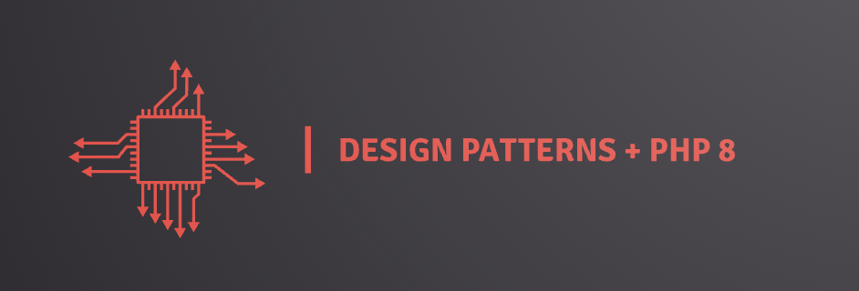

Everyweek a new Pattern + Article on www.medium.com/@anhaia.gabriel and www.medium.com/mestredev

# PHP 8.1 - Design Patterns

This repository was created to show the implementation of a variety of Design Patterns using PHP 8. There is no
dependency on a framework, and the examples are the most real as possible based on my own experiences solving real-life
problems. Once you learn the design pattern and its concept, it will be effortless to apply it in any PHP project.

## Patterns implemented + Article

| # | 📖 Pattern          | Code Example / Implementation    |   ✍️ Article / Post 📚  |                                                                               
| - | -----------         | -------------                    | -----------  |                                                                                          
| 1 | Adapter             |[HERE](https://github.com/gabrielanhaia/php-design-patterns/tree/main/src/Adapter)  | [LEARN HERE 📖 ](https://medium.com/mestredev/adapter-php-8-75e00034ae48) |                            
| 2 | Facade              |[HERE](https://github.com/gabrielanhaia/php-design-patterns/tree/main/src/Facade)  | [LEARN HERE 📖 ](https://medium.com/mestredev/facade-php-8-design-patterns-40b1ef8566b5)  |            
| 3 | Template Method     |[HERE](https://github.com/gabrielanhaia/php-design-patterns/tree/main/src/TemplateMethod)  | [LEARN HERE 📖 ](https://medium.com/mestredev/template-method-php-8-a357f3665a4b) |                     
| 4 | Strategy            |[HERE](https://github.com/gabrielanhaia/php-design-patterns/tree/main/src/Strategy)  | [LEARN HERE 📖 ](https://medium.com/mestredev/strategy-in-php-8-design-patterns-2044e5ef54ed) |        
| 5 | Abstract Factory    |[HERE](https://github.com/gabrielanhaia/php-design-patterns/tree/main/src/AbstractFactory)  | Soon  |
| 6 | Builder             |[HERE](https://github.com/gabrielanhaia/php-design-patterns/tree/main/src/Builder)  | Soon  |                                                                                                
| 7 | Composite           |[HERE](https://github.com/gabrielanhaia/php-design-patterns/tree/main/src/Composite)  | Soon  |                                                                                                
| 8 | Decorator           |[HERE](https://github.com/gabrielanhaia/php-design-patterns/tree/main/src/Decorator)  | Soon  |
| 9 | Factory Method      |[HERE](https://github.com/gabrielanhaia/php-design-patterns/tree/main/src/FactoryMethod)  | Soon  |
| 10 | Flyweight           |[HERE](https://github.com/gabrielanhaia/php-design-patterns/tree/main/src/Flyweight)  | Soon  |
| 11 | Iterator            |[HERE](https://github.com/gabrielanhaia/php-design-patterns/tree/main/src/Iterator)  | Soon  |
| 12 | Memento             |[HERE](https://github.com/gabrielanhaia/php-design-patterns/tree/main/src/Memento)  | Soon  |
| 13 | Money               |[HERE](https://github.com/gabrielanhaia/php-design-patterns/tree/main/src/Money)  | Soon  |
| 14 | Null Object         |[HERE](https://github.com/gabrielanhaia/php-design-patterns/tree/main/src/NullObject)  | Soon  |                                                                                                
| 15 | Observer            |[HERE](https://github.com/gabrielanhaia/php-design-patterns/tree/main/src/Observer)  | Soon  |                                                                                                
| 16 | Prototype           |[HERE](https://github.com/gabrielanhaia/php-design-patterns/tree/main/src/Prototype)  | Soon  |                                                                                                
| 17 | Proxy               |[HERE](https://github.com/gabrielanhaia/php-design-patterns/tree/main/src/Proxy)  | Soon  |                                                                                                
| 18 | Singleton           |[HERE](https://github.com/gabrielanhaia/php-design-patterns/tree/main/src/Singleton)  | Soon  |                                                                                                
| 19 | State               |[HERE](https://github.com/gabrielanhaia/php-design-patterns/tree/main/src/State)  | Soon  |                                                                                                

## Coming soon

- Bridge
- Chain of Responsibility
- Command
- Interpreter
- Mediator
- Object Pool
- Visitor

## Dependencies

- [Docker](https://www.docker.com)

## Running the project

I strongly recommend that you follow the articles (links above) and run them with Docker. It will be much easier, and you
need to install Docker on your computer, independent of the OS you are using. With a few commands, you will run/test all
the Design Patterns implemented throughout the course .

Build de container:

```# docker build -t design-patterns .``` or if you prefer ```# make build```

Run the following commands in order to test the design patterns:

```# make help``` and then you will see the list of commands

You just need to run the command with the pattern you want to test, for example:

```# make strategy```

## Additional Information

- If you take a look at the examples into the blog, or inside the folders `/src/{$pattern_name}/` you will notice that in almost
  all the examples contain a folder called `components`, those folders are the files/classes used to demonstrate how to
  use each pattern. Never consider what is in there as part of the pattern! They are not examples to be followed in your
  applications.
