# Behavioral Patterns

## Template Method

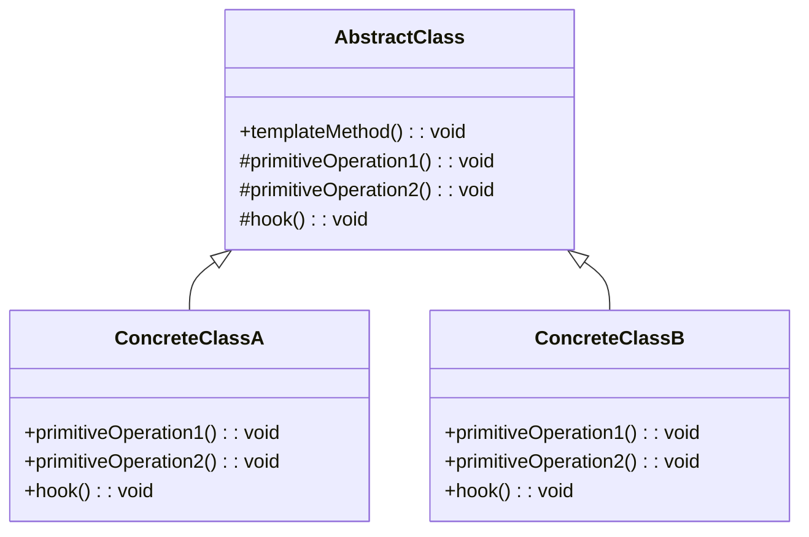

---

## Strategy

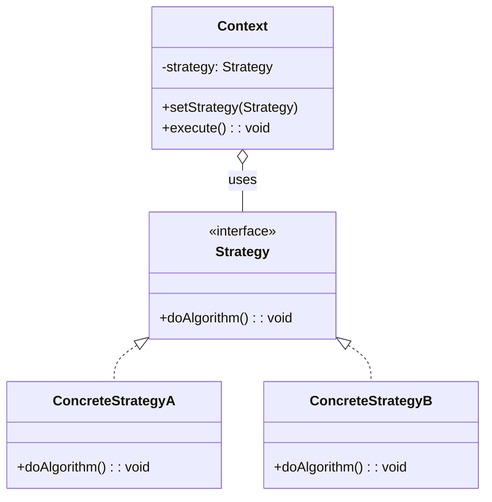

---

## Iterator

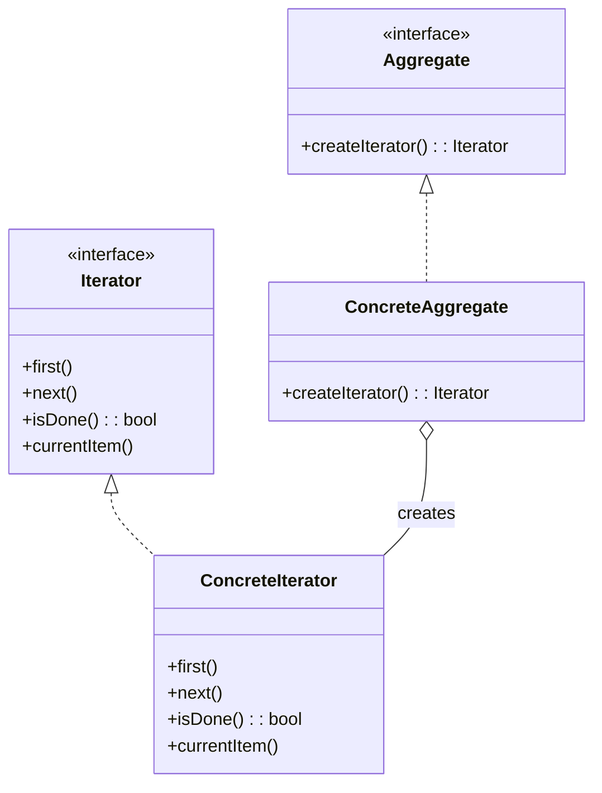

---

## Memento

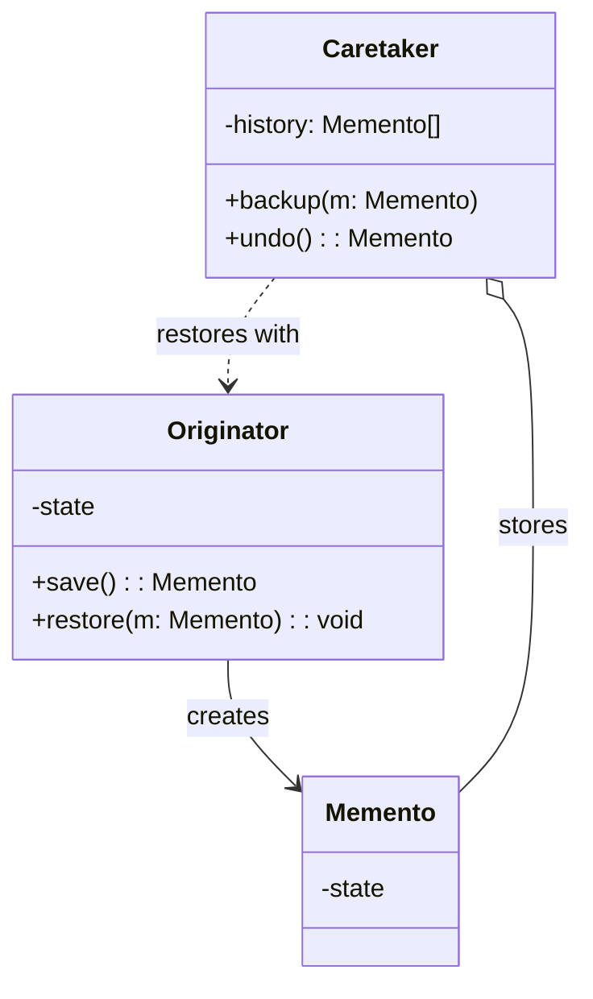

---

## Money

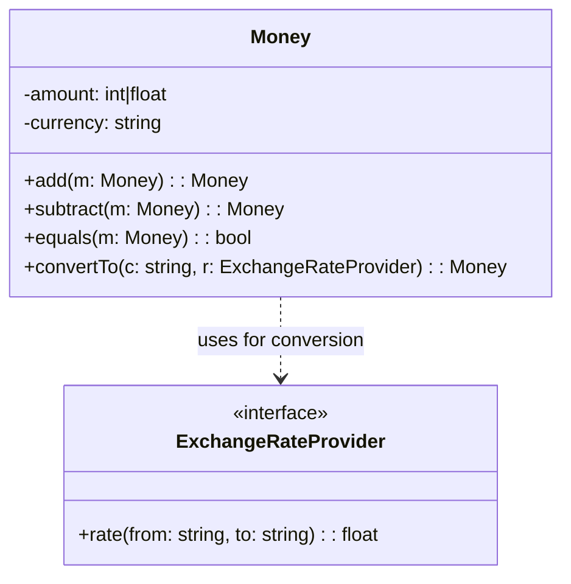

---

## Null Object

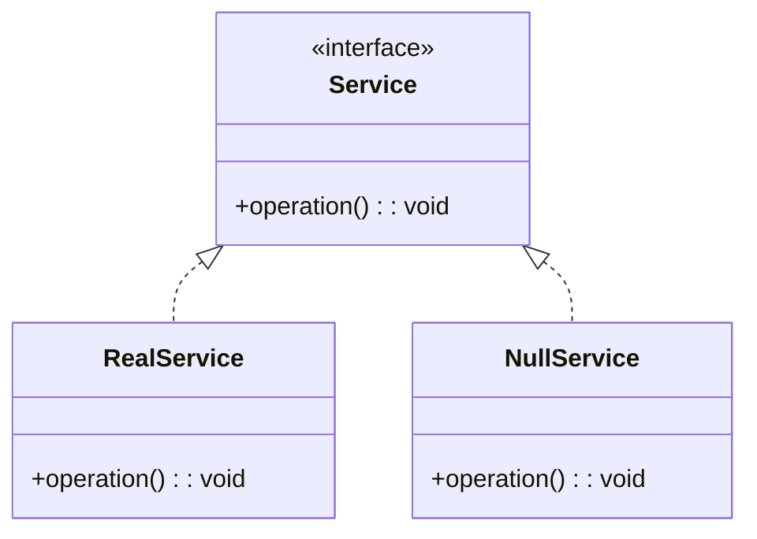

---

## Observer

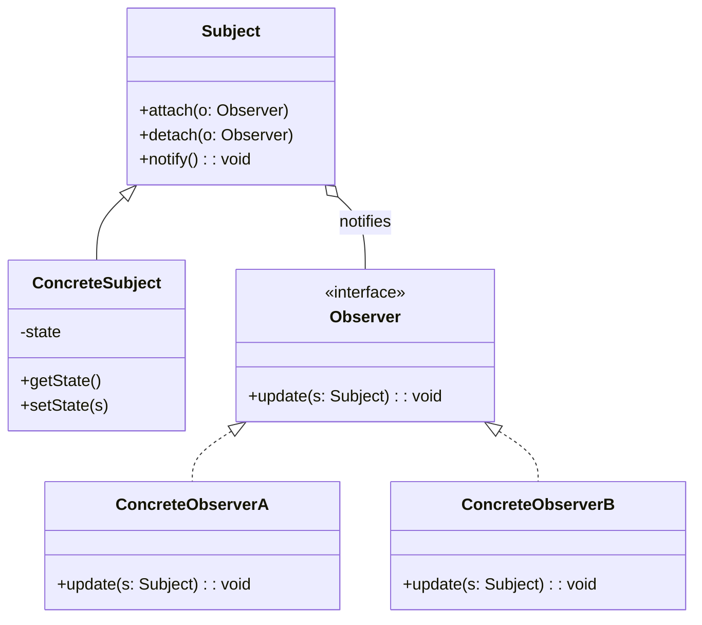

---

## State

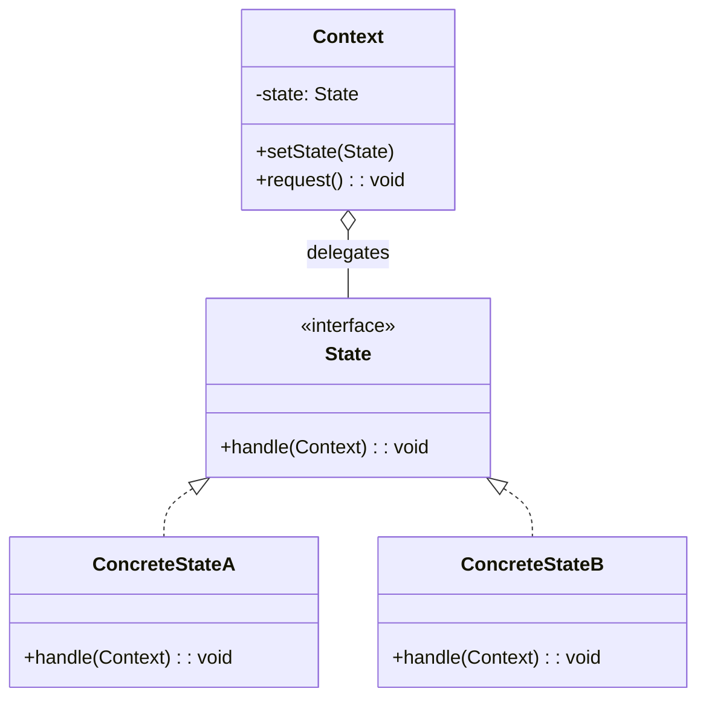

---

## Command

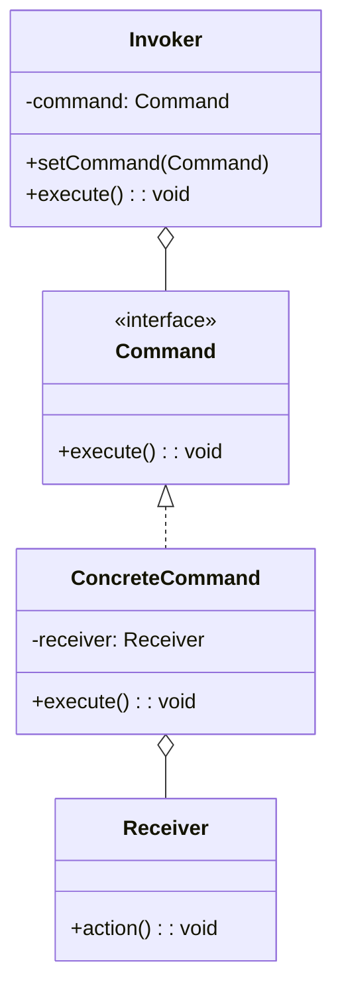

---

## Chain of Responsibility

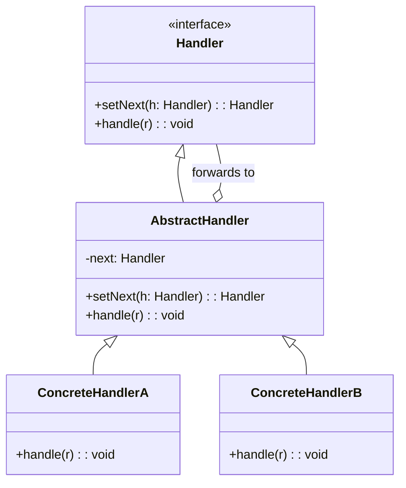

---

## Interpreter

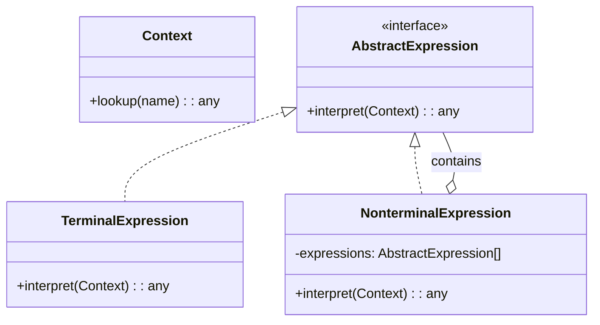

---

## Mediator

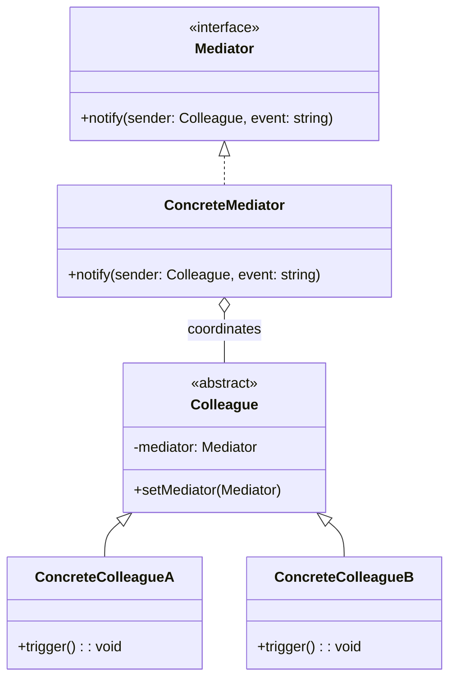

---

## Visitor

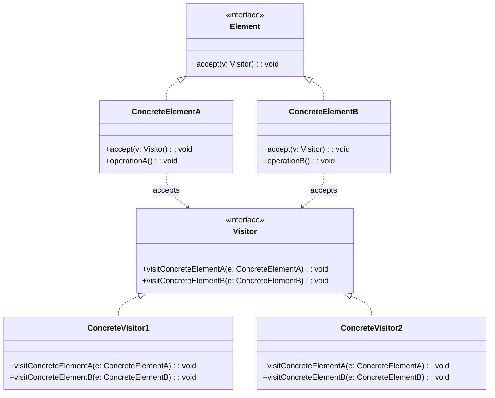

