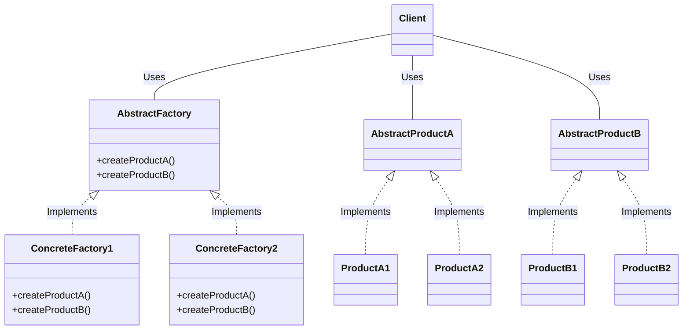
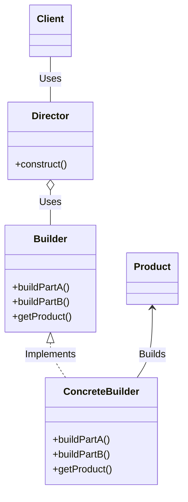
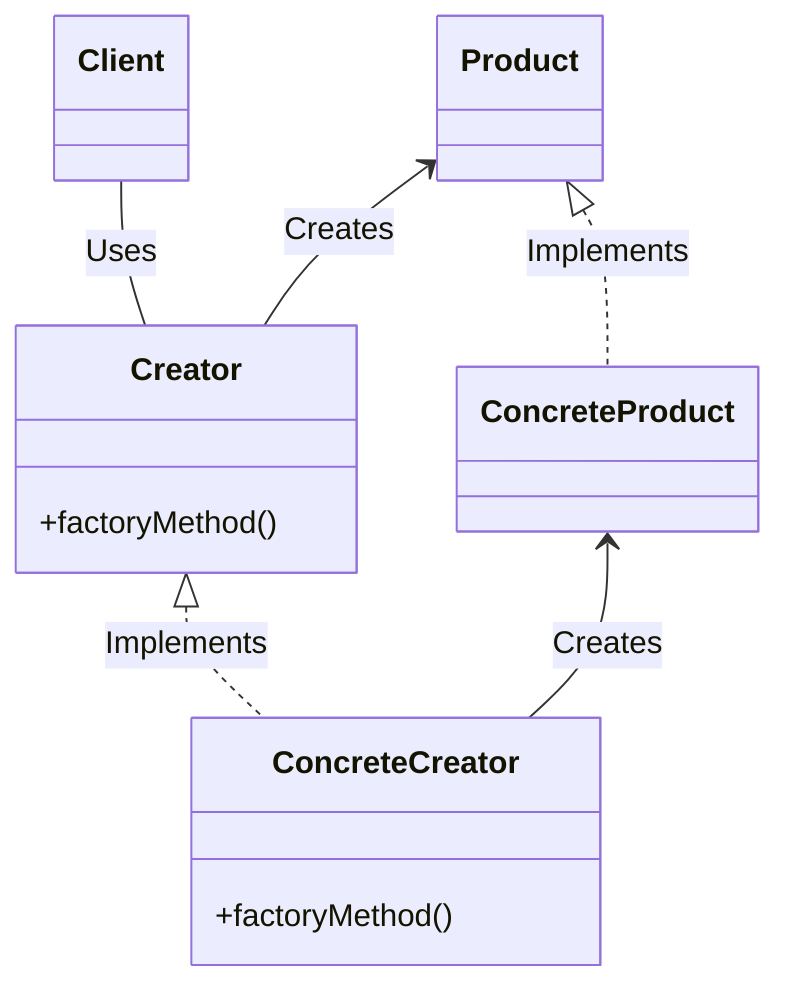
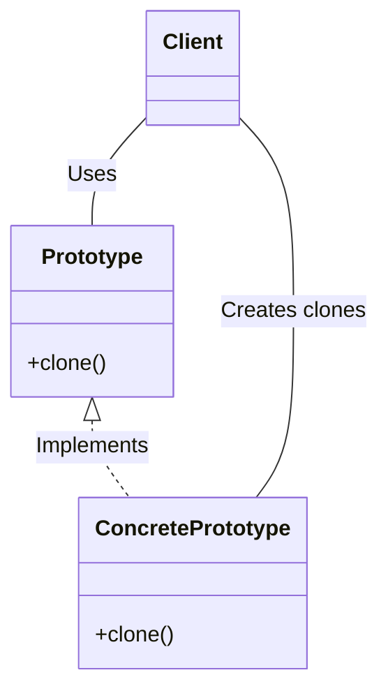
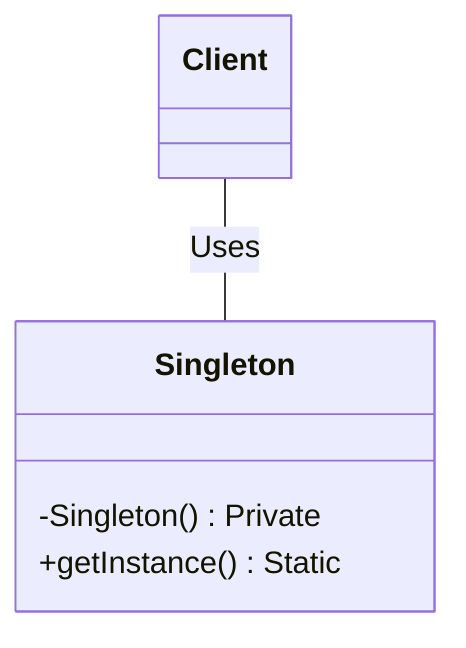
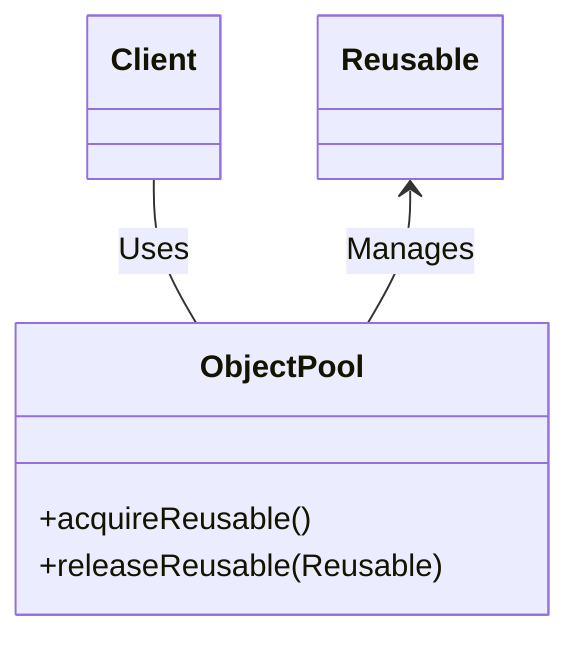

# Creational Patterns

## Abstract Factory

```mermaid
classDiagram
    Client -- AbstractFactory : Uses
    AbstractFactory <|.. ConcreteFactory1 : Implements
    AbstractFactory <|.. ConcreteFactory2 : Implements
    AbstractFactory : +createProductA()
    AbstractFactory : +createProductB()
    Client -- AbstractProductA : Uses
    Client -- AbstractProductB : Uses
    AbstractProductA <|.. ProductA1 : Implements
    AbstractProductA <|.. ProductA2 : Implements
    AbstractProductB <|.. ProductB1 : Implements
    AbstractProductB <|.. ProductB2 : Implements
    ConcreteFactory1 : +createProductA()
    ConcreteFactory1 : +createProductB()
    ConcreteFactory2 : +createProductA()
    ConcreteFactory2 : +createProductB()
```

---

## Builder   

```mermaid
classDiagram
    Client -- Director : Uses
    Director o-- Builder : Uses
    Builder <|.. ConcreteBuilder : Implements
    Builder : +buildPartA()
    Builder : +buildPartB()
    Builder : +getProduct()
    ConcreteBuilder : +buildPartA()
    ConcreteBuilder : +buildPartB()
    ConcreteBuilder : +getProduct()
    Product <-- ConcreteBuilder : Builds
    Director : +construct()

```

---

## Factory Method  

```mermaid
classDiagram
    Client -- Creator : Uses
    Creator <|.. ConcreteCreator : Implements
    Creator : +factoryMethod()
    Product <-- Creator : Creates
    ConcreteCreator : +factoryMethod()
    Product <|.. ConcreteProduct : Implements
    ConcreteProduct <-- ConcreteCreator : Creates
```

---

## Prototype

```mermaid
classDiagram
    Client -- Prototype : Uses
    Prototype <|.. ConcretePrototype : Implements
    Prototype : +clone()
    ConcretePrototype : +clone()
    Client -- ConcretePrototype : Creates clones
```

---

## Singleton

```mermaid
classDiagram
    Client -- Singleton : Uses
    Singleton : -Singleton() Private
    Singleton : +getInstance() Static
```

---

## Object Pool

```mermaid
classDiagram
    Client -- ObjectPool : Uses
    ObjectPool : +acquireReusable()
    ObjectPool : +releaseReusable(Reusable)
    Reusable <-- ObjectPool : Manages
```
