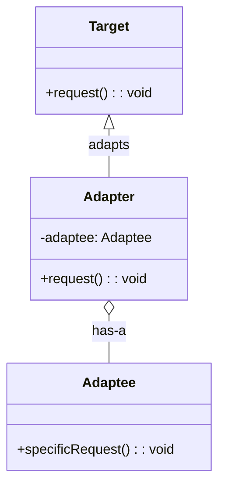
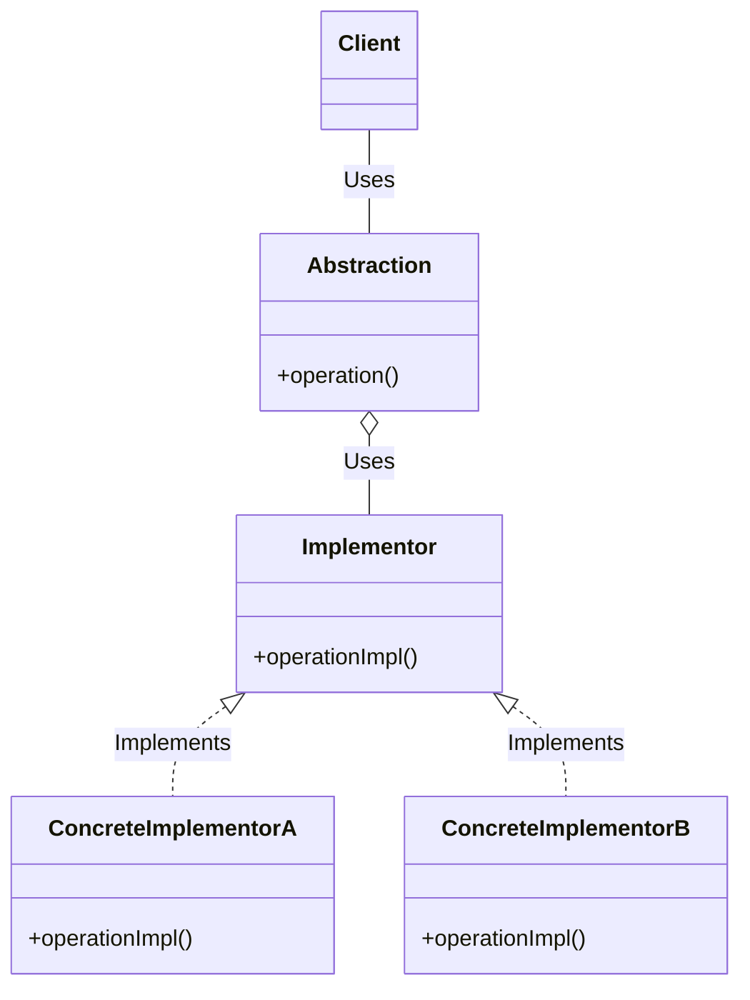
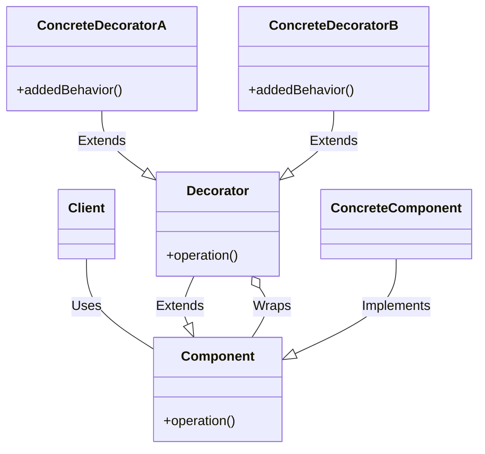
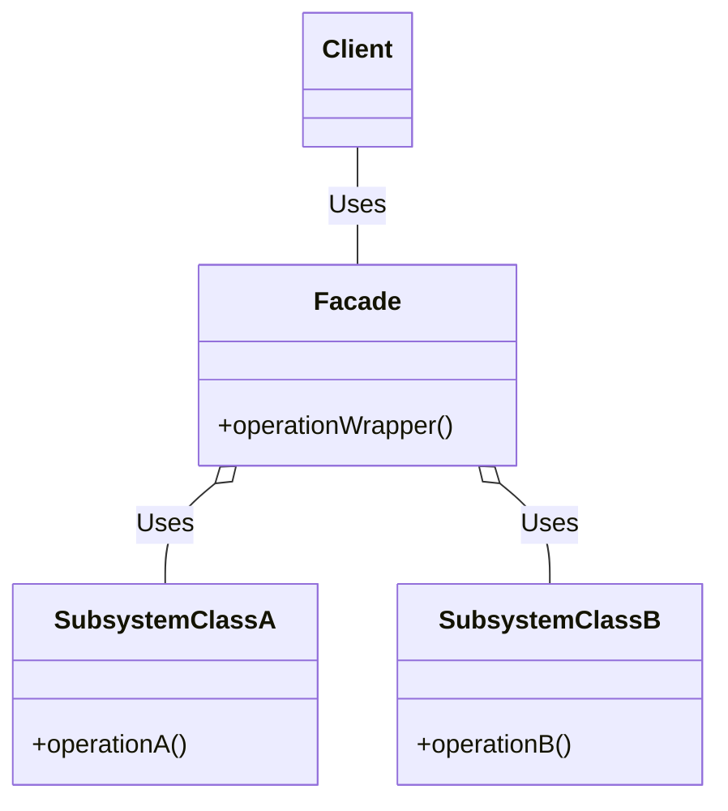
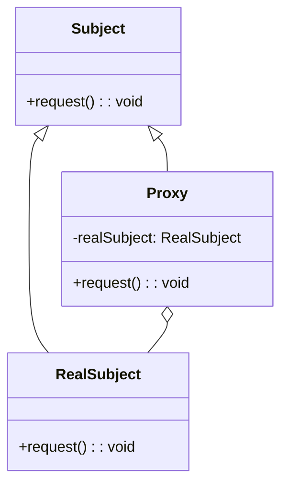
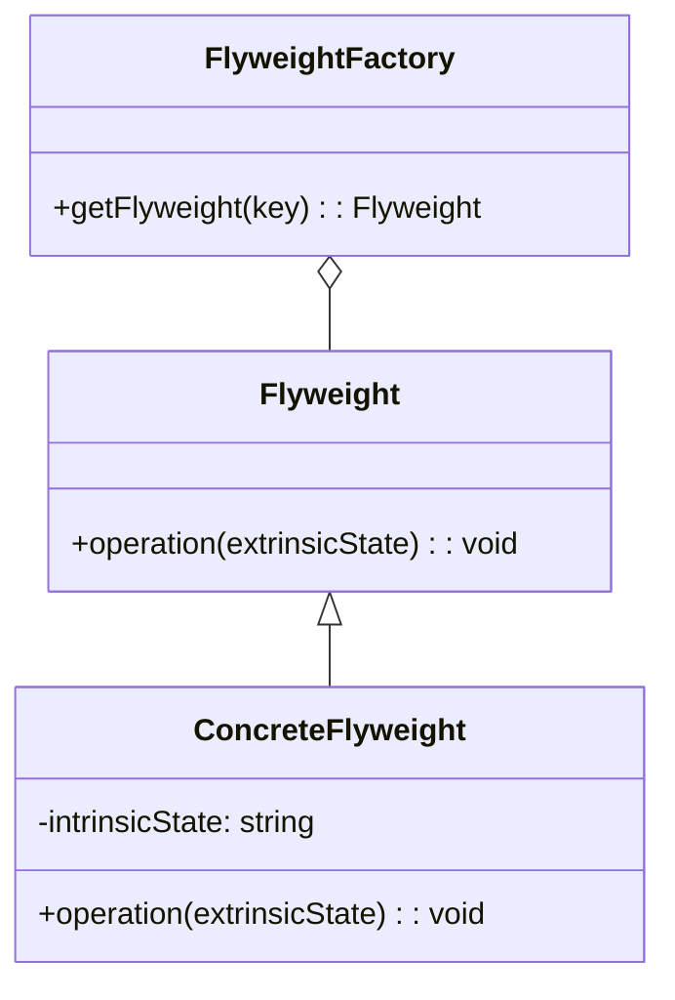
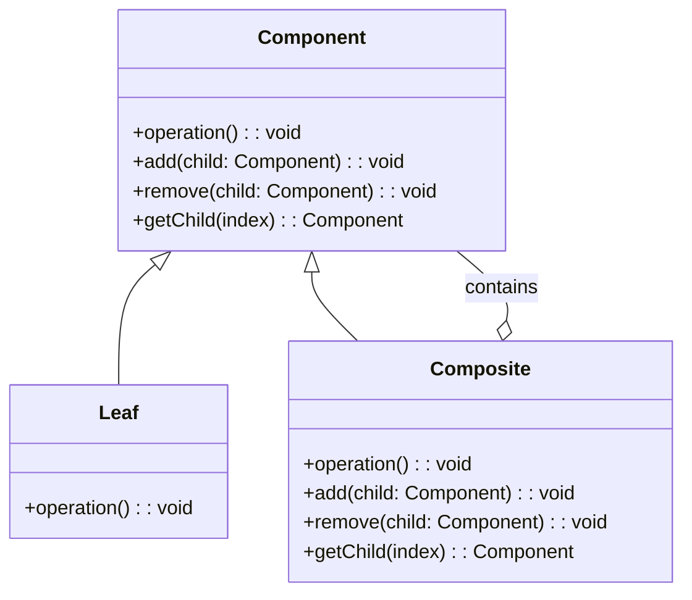

# Structural Patterns

## Adapter

```mermaid
classDiagram
    class Target {
        +request(): void
    }

    class Adapter {
        -adaptee: Adaptee
        +request(): void
    }

    class Adaptee {
        +specificRequest(): void
    }

    Target <|-- Adapter : adapts
    Adapter o-- Adaptee : has-a

```

---

## Bridge

```mermaid
classDiagram
    Client -- Abstraction : Uses
    Abstraction o-- Implementor : Uses
    Implementor <|.. ConcreteImplementorA : Implements
    Implementor <|.. ConcreteImplementorB : Implements
    Abstraction : +operation()
    Implementor : +operationImpl()
    ConcreteImplementorA : +operationImpl()
    ConcreteImplementorB : +operationImpl()
```

---

## Decorator

```mermaid
classDiagram
    Client -- Component : Uses
    Decorator --|> Component : Extends
    ConcreteDecoratorA --|> Decorator : Extends
    ConcreteDecoratorB --|> Decorator : Extends
    ConcreteComponent --|> Component : Implements
    Decorator o-- Component : Wraps
    Component : +operation()
    Decorator : +operation()
    ConcreteDecoratorA : +addedBehavior()
    ConcreteDecoratorB : +addedBehavior()
```

---

## Facade

```mermaid
classDiagram
    Client -- Facade : Uses
    Facade o-- SubsystemClassA : Uses
    Facade o-- SubsystemClassB : Uses

    class Facade {
        +operationWrapper()
    }

    class SubsystemClassA {
        +operationA()
    }

    class SubsystemClassB {
        +operationB()
    }
```

---

## Proxy

```mermaid
classDiagram
    class Subject {
        +request(): void
    }

    class RealSubject {
        +request(): void
    }

    class Proxy {
        -realSubject: RealSubject
        +request(): void
    }

    Subject <|-- RealSubject
    Subject <|-- Proxy
    Proxy o-- RealSubject
```

---

## Flyweight

```mermaid
classDiagram
    class FlyweightFactory {
        +getFlyweight(key): Flyweight
    }

    class Flyweight {
        +operation(extrinsicState): void
    }

    class ConcreteFlyweight {
        -intrinsicState: string
        +operation(extrinsicState): void
    }

    FlyweightFactory o-- Flyweight
    Flyweight <|-- ConcreteFlyweight
```

---

## Composite

```mermaid
classDiagram
    class Component {
        +operation(): void
        +add(child: Component): void
        +remove(child: Component): void
        +getChild(index): Component
    }

    class Leaf {
        +operation(): void
    }

    class Composite {
        +operation(): void
        +add(child: Component): void
        +remove(child: Component): void
        +getChild(index): Component
    }

    Component <|-- Leaf
    Component <|-- Composite
    Composite o-- Component : contains
```
